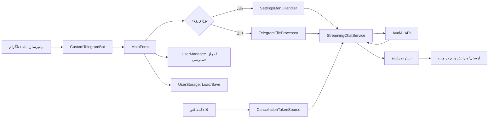

# BaleAiBotV2

ربات هوش مصنوعی حرفه‌ای برای **بله** و **تلگرام** با رابط مدیریت دسکتاپ (WinForms)، استریم پاسخ، تحلیل فایل/تصویر/صوت و مدیریت سطح دسترسی کاربران.

این پروژه از API شرکت **AvalAI** برای مدل‌های زبانی/چندرسانه‌ای استفاده می‌کند و برای ساخت یک چت‌بات عملیاتی و قابل مدیریت طراحی شده است.

---

## ✨ امکانات کلیدی

- پشتیبانی از پیام‌رسان‌های **بله** و **تلگرام** (از طریق تنظیم Base URL)
- گفت‌وگوی متنی با **پاسخ استریم (Streaming)**
- پشتیبانی از **تصویر** (تحلیل تصویر با مدل چندوجهی)
- پشتیبانی از **فایل صوتی/ویس** (تبدیل گفتار به متن + پاسخ هوشمند)
- پشتیبانی از **اسناد**: PDF, DOCX, XLS/XLSX, TXT, CSV
- منوی تنظیمات داخل چت:
  - تغییر مدل
  - تغییر دما (Temperature)
  - تغییر Max Tokens
  - تغییر System Prompt
- قابلیت **لغو پردازش** هنگام پاسخ‌دهی
- مدیریت کاربران مجاز + سطح دسترسی (Active, File Access, Model Access, ...)
- بررسی اعتبار API از داخل بات
- ذخیره‌سازی تاریخچه و تنظیمات هر کاربر به‌صورت جداگانه
- اجرای تک‌نمونه‌ای (Single Instance) و Minimize به System Tray

---

## 🧱 تکنولوژی‌ها

- **.NET 8 (Windows / WinForms)**
- `Telegram.Bot`
- `OpenAI` SDK (با Endpoint سفارشی AvalAI)
- `PdfPig` + `NPOI` برای استخراج متن اسناد
- `System.Text.Json` برای تنظیمات و داده‌ها

---

## 📁 ساختار پروژه

- `BaleAiBotV2/MainForm.cs` → هسته مدیریت ربات و UI
- `BaleAiBotV2/Helpers/StreamingChatService.cs` → استریم پاسخ متنی/تصویری + تبدیل صوت
- `BaleAiBotV2/Helpers/TelegramFileProcessor.cs` → پردازش فایل‌های ورودی
- `BaleAiBotV2/Helpers/SettingsMenuHandler.cs` → منوی تنظیمات داخل چت
- `BaleAiBotV2/Helpers/UserManager.cs` → لیست کاربران مجاز و مجوزها
- `BaleAiBotV2/Helpers/UserStorage.cs` → ذخیره تاریخچه و تنظیمات کاربر
- `BaleAiBotV2/botconfig.json` → تنظیمات اصلی ربات
- `BaleAiBotV2/ValidUsers/users.json` → کاربران مجاز

---

## 🧩 توضیح کلاس‌های مهم

### `StreamingChatService`

مسئول ارتباط مستقیم با API هوش مصنوعی و دریافت پاسخ‌ها به‌صورت **Streaming** است.

وظایف اصلی:
- ساخت `OpenAIClient` با `AVAL_API_KEY` و `AVAL_BASE_URL`
- تبدیل تاریخچه کاربر به فرمت قابل ارسال برای مدل
- ارسال درخواست چت و دریافت پاسخ توکنی (stream)
- اضافه‌کردن پاسخ نهایی دستیار به تاریخچه
- مدیریت محدودیت تاریخچه (`MAX_HISTORY`)
- تبدیل فایل صوتی به متن با متد `TranscribeAudioAsync`

این کلاس قلب موتور AI پروژه است و هرجا پاسخ مدل لازم باشد استفاده می‌شود.

---

### `TelegramFileProcessor`

این کلاس مسیر کامل پردازش فایل‌های ورودی کاربر را مدیریت می‌کند.

وظایف اصلی:
- تشخیص نوع فایل ورودی (Image / Voice / Audio / Document / Video)
- دانلود فایل از API پیام‌رسان
- هدایت پردازش به متد تخصصی هر نوع فایل:
  - `ProcessImageAsync`
  - `ProcessAudioAsync`
  - `ProcessDocumentAsync`
- ویرایش پیام «در حال پردازش» به‌صورت لحظه‌ای
- پشتیبانی از لغو عملیات با `CancellationToken`
- ذخیره خروجی پردازش در `UserStorage`

خلاصه: این کلاس لایه‌ی **Orchestration** برای فایل‌هاست؛ یعنی ورودی فایل را گرفته و آن را تا پاسخ نهایی مدیریت می‌کند.

---

### `SettingsMenuHandler`

مدیریت کامل منوی تنظیمات داخل چت (Reply/Inline Keyboard) در این کلاس انجام می‌شود.

وظایف اصلی:
- نمایش منوی تنظیمات (`ShowSettings`)
- رسیدگی به دکمه‌های callback (`HandleCallback`)
- دریافت ورودی‌های مرحله‌ای کاربر (`HandleStateInput`)
- نمایش لیست مدل‌ها و اعمال تغییر مدل
- تغییر دما، توکن و پرامپت سیستم
- پاک‌سازی تاریخچه مکالمه (`ClearHistory`)
- بازگرداندن کیبورد اصلی (`ReturnMainKeyboard`)

این کلاس باعث می‌شود تجربه تنظیمات کاربر، تعاملی و ساختاریافته باشد.

---

### `UserStorage`

این کلاس مسئول ذخیره‌سازی و بازیابی داده‌های هر کاربر است.

وظایف اصلی:
- ساخت/خواندن پروفایل هر کاربر (`UserData`)
- نگهداری تنظیمات شخصی کاربر (`UserSettings`)
- ذخیره تاریخچه چت و فایل‌های اخیر
- ذخیره داده‌ها در مسیر `Data/Users`
- رمزگذاری/رمزگشایی داده‌ها با AES
- استفاده از قفل همزمانی per-user برای جلوگیری از تداخل نوشتن/خواندن

نتیجه: هر کاربر تنظیمات و تاریخچه مستقل خودش را دارد و داده‌ها به‌صورت امن‌تر نسبت به plain JSON نگهداری می‌شوند.

---

## 🔄 جریان اجرای پروژه (Flow)

در این بخش، مسیر اجرای درخواست از لحظه دریافت پیام تا ارسال پاسخ نهایی به‌صورت خلاصه آمده است:

1. **دریافت آپدیت از پیام‌رسان**
   - `CustomTelegramBot` آپدیت/پیام را دریافت می‌کند.
   - `MainForm` هندلرهای `OnMessage` و `OnUpdate` را مدیریت می‌کند.

2. **اعتبارسنجی کاربر و وضعیت دسترسی**
   - با `UserManager` بررسی می‌شود کاربر مجاز هست یا نه.
   - اگر کاربر غیرمجاز باشد، پاسخ رد دسترسی ارسال می‌شود.

3. **بارگذاری وضعیت کاربر**
   - `UserStorage.Load(chatId)` اطلاعات قبلی کاربر (تنظیمات/تاریخچه/State) را بارگذاری می‌کند.

4. **تشخیص نوع ورودی**
   - اگر پیام متنی باشد:
     - دستورات (`/start`, `/settings`, ... ) بررسی می‌شوند.
     - در صورت نیاز، `SettingsMenuHandler` فرآیند تنظیمات را ادامه می‌دهد.
   - اگر پیام فایل باشد:
     - درخواست به `TelegramFileProcessor` سپرده می‌شود.

5. **پردازش هوشمند**
   - برای متن/تصویر/سند/صوت، در نهایت `StreamingChatService` با مدل انتخاب‌شده تماس می‌گیرد.
   - پاسخ به‌صورت استریم دریافت شده و پیام در چت به‌مرور ویرایش می‌شود.

6. **قابلیت لغو عملیات**
   - کاربر می‌تواند با دکمه `❌ لغو`، عملیات جاری را متوقف کند.
   - این کار با `CancellationTokenSource` برای همان `chatId` انجام می‌شود.

7. **ثبت خروجی و ذخیره‌سازی نهایی**
   - پاسخ نهایی در تاریخچه کاربر ثبت می‌شود.
   - `UserStorage.Save(...)` داده‌های به‌روزشده را ذخیره می‌کند.

8. **آماده برای درخواست بعدی**
   - وضعیت پردازش فعال پاک می‌شود و کاربر می‌تواند درخواست جدید ارسال کند.

### نمای ساده معماری

`Messaging Platform (Bale/Telegram)` → `CustomTelegramBot/MainForm` → `UserManager + UserStorage` → `SettingsMenuHandler / TelegramFileProcessor` → `StreamingChatService (AvalAI)` → `Response Streaming to Chat`

### دیاگرام معماری (Mermaid)

> اگر در Preview گیت‌هاب دیاگرام را نمی‌بینید، یک بار صفحه را رفرش کنید یا از حالت نمایش فایل در خود GitHub استفاده کنید.

---

## ⚙️ پیش‌نیازها

- Windows (به‌دلیل WinForms)
- .NET SDK 8.0
- یک Bot Token برای بله یا تلگرام
- API Key از AvalAI

---

## 🚀 راه‌اندازی سریع

1. پروژه را Clone کنید.
2. فایل `BaleAiBotV2/botconfig.json` را تنظیم کنید.
3. برنامه را با Visual Studio (یا `dotnet`) اجرا کنید.
4. در UI برنامه روی **Start** بزنید.
5. کاربر(ها) را در لیست مجاز قرار دهید تا بتوانند از بات استفاده کنند.

---

## 🛠 تنظیمات `botconfig.json`

فیلدهای مهم:

- `BOT_TOKEN`: توکن بات
- `BASE_URL`: آدرس API پیام‌رسان (برای بله یا تلگرام)
- `BALE_FILE_URL`: آدرس دانلود فایل (برای بله)
- `AVAL_API_KEY`: کلید API سرویس AvalAI
- `AVAL_BASE_URL`: آدرس پایه API مدل‌ها
- `AVAL_BASE_CREDIT`: آدرس بررسی اعتبار
- `DEFAULT_MODEL`: مدل پیش‌فرض
- `MODELS`: لیست مدل‌های قابل انتخاب در منو
- `MAX_HISTORY`: حداکثر تعداد پیام تاریخچه
- `IMAGE_MAX_SIZE_COMPRESS`: حداکثر سایز تصویر بعد از فشرده‌سازی
- `MAX_DOCTEXTSIZE`: سقف متن استخراج‌شده از سند
- `STREAM_EDIT_INTERVAL` و `STREAM_MIN_CHARS`: تنظیمات به‌روزرسانی استریم

> نکته: اگر از تلگرام استفاده می‌کنید، `BASE_URL` را متناسب با API تلگرام تنظیم کنید.

---

## 👤 مدیریت کاربران

دسترسی کاربران از طریق فایل `ValidUsers/users.json` و همچنین پنل UI مدیریت می‌شود.

سطوح دسترسی قابل کنترل:

- فعال/غیرفعال بودن کاربر
- امکان ارسال فایل
- دسترسی به منوی تنظیمات
- امکان تغییر مدل
- امکان تغییر System Prompt
- امکان تغییر Max Tokens

اگر کاربر در لیست مجاز نباشد، ربات درخواست او را رد می‌کند.

---

## 💬 امکانات داخل چت

- `/start` → شروع و نمایش کیبورد اصلی
- `⚙️ تنظیمات` یا `/settings` → منوی تنظیمات
- `✨ گفتگوی جدید` → پاک‌سازی تاریخچه گفتگو
- `💰 بررسی اعتبار` → نمایش اعتبار AvalAI
- دکمه `❌ لغو` → توقف پردازش جاری

---

## 🔐 نکات امنیتی مهم

- **هرگز** `BOT_TOKEN` و `AVAL_API_KEY` واقعی را در GitHub منتشر نکنید.
- بهتر است قبل از انتشار، فایل `botconfig.json` را با مقادیر نمونه جایگزین کنید.
- دسترسی کاربران را محدود و بازبینی دوره‌ای کنید.

---

## 📌 نکته درباره محدودیت‌ها

این پروژه در سطح کد، محدودیت سخت‌گیرانه‌ای برای کاربر نهایی اعمال نکرده و رفتار مصرفی آن عمدتاً به محدودیت‌ها/پلن سرویس‌دهنده API (AvalAI و پیام‌رسان مقصد) وابسته است.

---

## 📄 مجوز

این پروژه تحت مجوز موجود در فایل `LICENSE.txt` منتشر شده است.